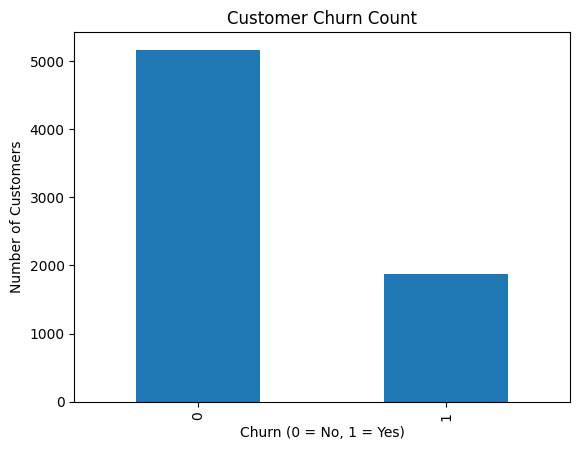
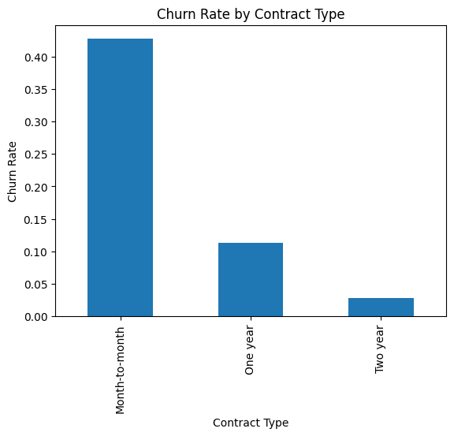
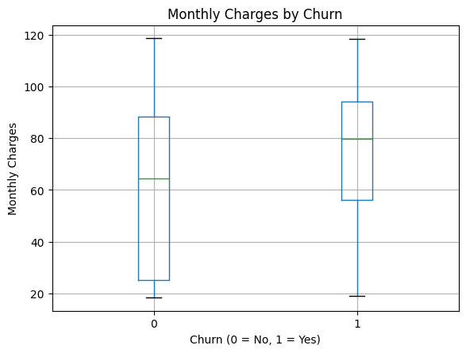
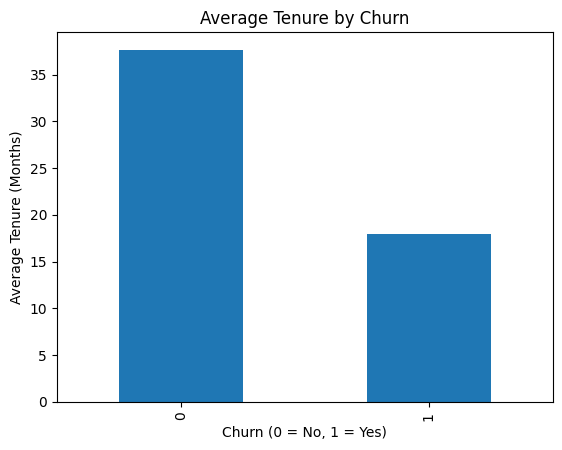

# Customer Churn Analysis (Python)

## Overview

In this project, I analyzed customer churn data using Python to identify patterns that lead customers to leave a service. The goal was to explore customer behavior and provide insights that can help improve customer retention.

This project focuses on data cleaning, data analysis, visualization, and turning data into business insights.

---

## Tools & Technologies

* Python
* pandas
* matplotlib
* Jupyter Notebook

---

## Key Questions

* Which customers are most likely to churn?
* Does contract type affect churn?
* Do higher monthly charges lead to more churn?
* Are newer customers more likely to leave?

---

## Key Insights

* Customers with **month-to-month contracts** have the highest churn rate
* Customers with **higher monthly charges** are more likely to churn
* Customers with **shorter tenure** are significantly more likely to leave

---

## Visualizations

### Churn Count



### Churn by Contract Type



### Monthly Charges vs Churn



### Tenure vs Churn



---

## Business Recommendations

* Encourage customers to switch to long-term contracts through discounts or incentives
* Offer better pricing or value to high-paying customers
* Improve onboarding and early customer experience to reduce early churn

---

## Project Structure

```
customer-churn-python-analysis/
│
├── data/
│   └── Telco-Customer-Churn.csv
│
├── notebooks/
│   └── churn_analysis.ipynb
│
├── images/
│   ├── churn_count.png
│   ├── churn_by_contract.png
│   ├── churn_vs_monthly.png
│   └── churn_vs_tenure.png
│
├── README.md
```

---

## How to Run This Project

1. Clone the repository
2. Install required libraries:

   ```
   pip install pandas matplotlib notebook
   ```
3. Open Jupyter Notebook:

   ```
   jupyter notebook
   ```
4. Open `churn_analysis.ipynb` and run all cells

---

## About Me

I am a Computer Science student focused on building skills in data analysis, Python, and data visualization. I enjoy working with data to find patterns and turn them into meaningful insights.
